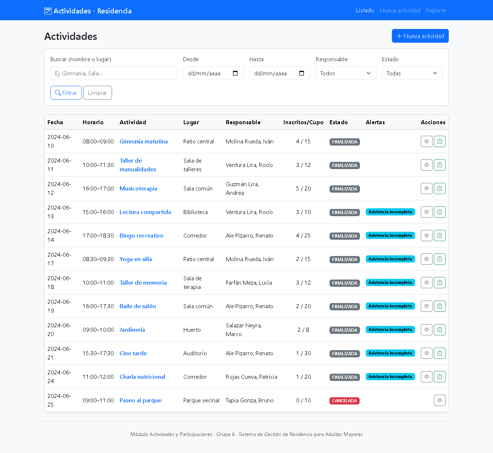
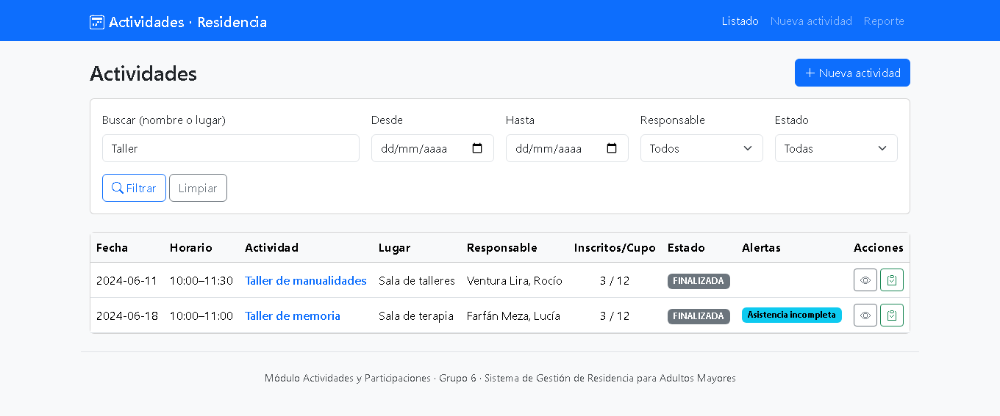
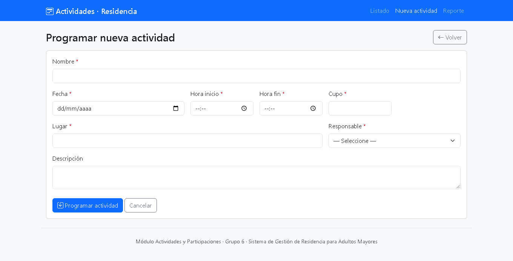
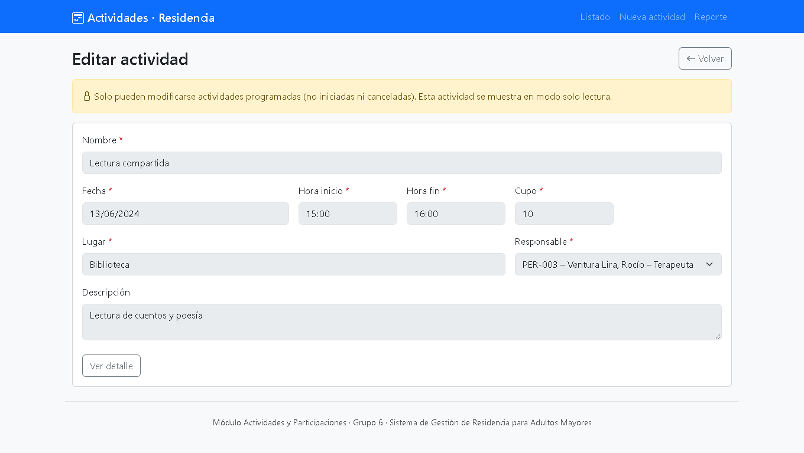
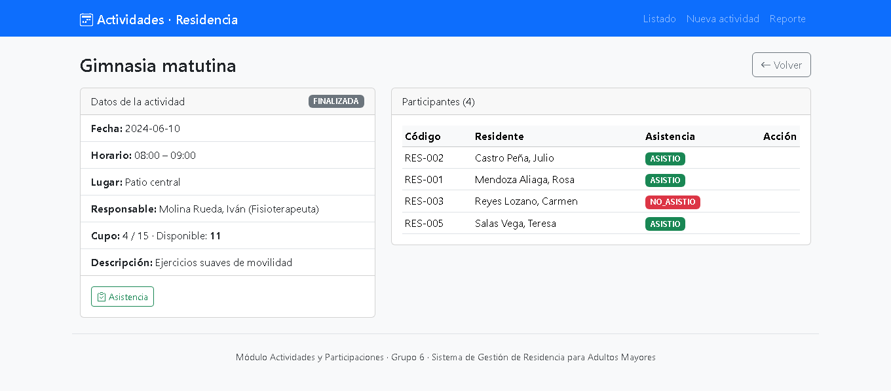
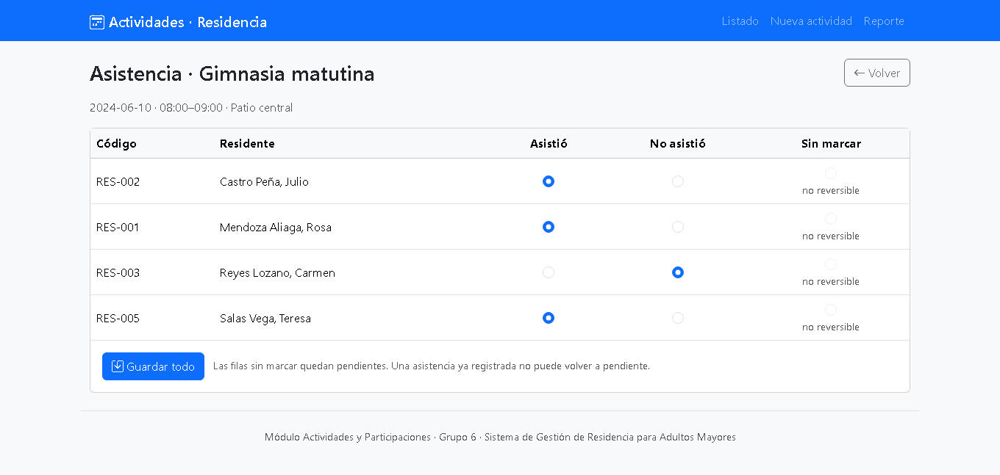
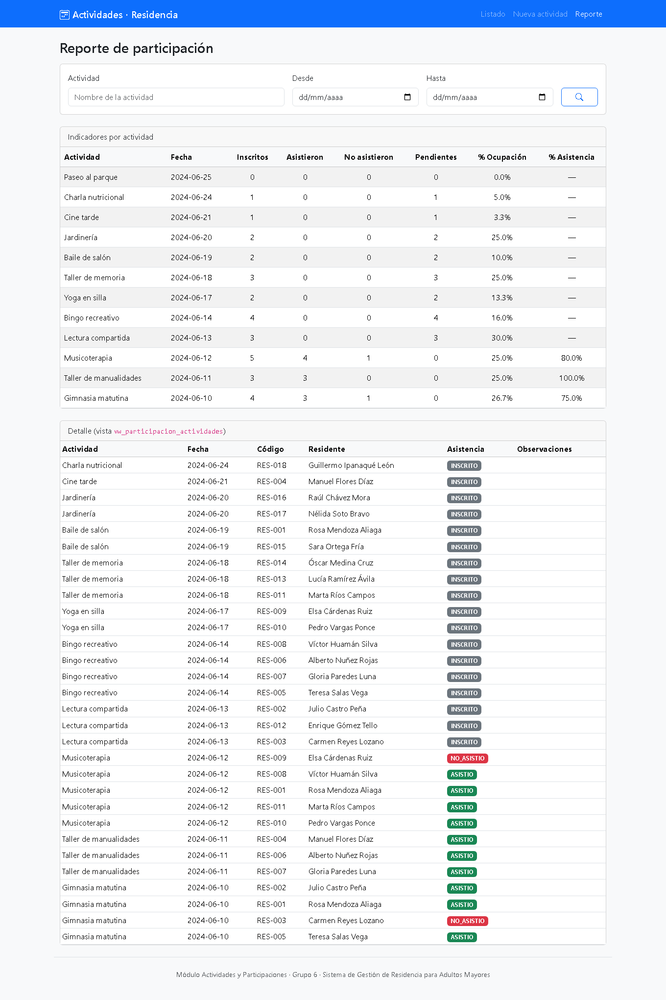

# Módulo Actividades y Participaciones — Grupo 6

CRUD de **actividades** recreativas/terapéuticas y **participaciones** (inscripción y
asistencia) del *Sistema de Gestión de Residencia para Adultos Mayores*.

> Curso: Desarrollo de Plataformas · Stack: PHP 8 + PDO + MySQL/MariaDB (XAMPP)
> Rama de trabajo: `dev/grupo6` (módulo del `feature/grupo-6-actividades`)

## 👥 Integrantes
- Abarca Melendez Luis Marcelo
- Farroñan Quiñones Alex Josue
- Lopez Lopez Jheremy Llair
- Lopez Tuesta Julio Cesar
- Meza Villacorta Jhohan Lizandro
- Vargas Cordova Diego Arnold

---

## 1. Tablas utilizadas

| Tabla | Acceso | Uso |
|---|---|---|
| `actividades` | Lectura/Escritura | CRUD de actividades (propia del módulo) |
| `participaciones` | Lectura/Escritura | Inscripción y asistencia (propia del módulo) |
| `residentes` | Solo lectura | Combo de inscripción y validación de estado/fecha de ingreso |
| `personal` | Solo lectura | Combo de responsable (solo `ACTIVO`) |
| `vw_participacion_actividades` | Solo lectura | Reporte de participación (HU-04) |

No se modifican tablas, vistas, columnas ni datos de otros grupos.

## 2. Cómo importar la base de datos

1. Iniciar **XAMPP** (Apache + MySQL).
2. En phpMyAdmin (o consola): importar el `database.sql` oficial del docente.
   - Consola: `mysql -u root < database.sql`
3. El script crea la BD `sistema_residencia`, las 10 tablas, las 2 vistas y el
   usuario de aplicación **`residencia_app`** con sus privilegios.

## 3. Cómo configurar la conexión

La conexión del módulo está en [`config/conexion.php`](config/conexion.php) y usa
**PDO** con el usuario de aplicación (nunca `root`), tal como exige el requerimiento
técnico del docente:

```php
DB_HOST = localhost
DB_NAME = sistema_residencia
DB_USER = residencia_app
DB_PASS = residencia_app_2024   // definido en el CREATE USER del database.sql
```

Si tu `database.sql` define otra clave para `residencia_app`, actualiza `DB_PASS`.

## 4. Cómo ejecutar

Copiar el repositorio dentro de `xampp/htdocs/` y entrar a:

```
http://localhost/sistema-gestion-adultos-mayores/Admin/actividades/index.php
```

## 5. Estructura del módulo

```
Admin/actividades/
├── config/conexion.php          Conexión PDO (residencia_app)
├── includes/
│   ├── helpers.php              e(), flash(), csrf(), ahora(), estado_temporal()
│   └── plantilla.php            Cabecera/pie + navegación (Bootstrap 5)
├── logica/
│   ├── Validador.php            Validación de formato (RN-01..RN-05)
│   ├── ActividadRepositorio.php     SQL de actividades (preparado)
│   ├── ParticipacionRepositorio.php SQL de participaciones (preparado)
│   ├── ConsultaRepositorio.php      Combos, vista e indicadores
│   ├── ActividadServicio.php        Reglas + transacciones de actividades
│   └── ParticipacionServicio.php    Reglas + transacciones de participaciones
├── acciones/                    Controladores POST (PRG): guardar, cancelar,
│                                reactivar, inscribir, anular, asistencia
├── index.php     P1 Listado + búsqueda/filtros
├── form.php      P2 Crear/Editar
├── ver.php       P3 Detalle + participantes
├── asistencia.php  P4 Registro de asistencia
└── reporte.php   P5 Reporte (vista + indicadores)
```

Las vistas no contienen SQL, los repositorios no contienen HTML y los servicios
aplican las reglas de negocio.

## 6. Historias de usuario cubiertas

| HU | Descripción |
|---|---|
| HU-01 | Programar actividad |
| HU-02 | Inscribir residentes respetando el cupo |
| HU-03 | Registrar asistencia (ASISTIO/NO_ASISTIO) |
| HU-04 | Consultar la vista de participación |
| HU-05 | Listar y buscar/filtrar actividades *(requerimiento común)* |
| HU-06 | Editar actividad *(requerimiento común)* |
| HU-07 | Cancelar actividad — baja lógica *(requerimiento común)* |
| HU-08 | Anular inscripción *(derivada)* |

## 7. Verificación del esquema real (checklist 3.3 resuelto)

Contrastado contra el `database.sql` oficial (fuente técnica principal):

| ID | Resultado en el esquema oficial | Decisión aplicada |
|---|---|---|
| V-01 | `actividades.estado ENUM('PROGRAMADA','REALIZADA','CANCELADA')` | **Variante B**: baja lógica = `CANCELADA` |
| V-02 | `participaciones.asistencia ENUM('INSCRITO','ASISTIO','NO_ASISTIO') DEFAULT 'INSCRITO'` | "Pendiente" = **`INSCRITO`** |
| V-03 | Columna responsable = **`id_personal`** (nullable, `ON DELETE SET NULL`) | Se usa `id_personal` |
| V-04 | `participaciones → actividades` = `ON DELETE CASCADE` | No se depende del CASCADE; se usa Variante B |
| V-05 | CHECK `cupo>0` y `hora_fin>hora_inicio` | Se validan también en PHP |
| V-06 | La vista es **agregada** (una fila por actividad) con `inscritos/asistieron/no_asistieron/cupo` | Indicadores calculados desde la vista; detalle nominal desde tablas base |
| V-07 | `residencia_app` tiene `SELECT,INSERT,UPDATE,DELETE` | OK (permite anular/cancelar) |
| V-08 | `nombre VARCHAR(100)`, `lugar VARCHAR(80)`, `descripcion VARCHAR(255)`, `observacion VARCHAR(150)` | `maxlength` + `mb_strlen` con esos límites |
| V-10 | InnoDB | Transacciones y `FOR UPDATE` operativos |

**Diferencia importante:** el esquema oficial **no** tiene columna `tipo` (que sí aparecía
en una versión alterna de `database.sql`). El módulo se ajustó al esquema oficial.

## 8. Aspectos técnicos (rúbrica §11 y requerimientos §8)

- **PDO + consultas preparadas al 100 %** (`PDO::ATTR_EMULATE_PREPARES=false`); los
  fragmentos dinámicos del `WHERE`/`ORDER BY` salen de listas blancas del código.
- **Usuario `residencia_app`** (no `root`).
- **Transacciones** con `SELECT ... FOR UPDATE` para el control de cupo concurrente (RN-17).
- **Seguridad:** escape XSS con `htmlspecialchars`, token **CSRF** con `hash_equals`,
  IDs validados con `filter_var(... FILTER_VALIDATE_INT)`, patrón **PRG** tras cada POST.
- **Hora única** en `America/Lima` desde PHP (sin `NOW()`/`CURDATE()` en SQL).

## 9. Capturas de pantalla

Capturas del módulo funcionando sobre los datos de ejemplo del `database.sql`.

### 9.1. Listado, búsqueda y filtros — HU-05

Pantalla principal: fecha, horario, lugar, responsable, ocupación (inscritos/cupo),
estado calculado (Programada/Finalizada/Cancelada) y alertas automáticas.



Búsqueda por nombre o lugar y filtros por fecha, responsable y estado
(ejemplo: búsqueda del término «Taller»):



### 9.2. Programar y editar actividades — HU-01 · HU-06

Alta de una nueva actividad (Create) con validación en el servidor:



Edición de una actividad existente (Update), reutilizando el mismo formulario:



### 9.3. Detalle, inscripción y anulación — HU-02 · HU-08

Detalle de la actividad con el listado nominal de participantes; desde aquí se
inscriben residentes (respetando el cupo) y se anulan inscripciones:



### 9.4. Registro de asistencia — HU-03

Marcado por residente (Asistió / No asistió / Sin marcar). Solo se habilita cuando
la actividad ya comenzó; una asistencia registrada no vuelve a estado pendiente:



### 9.5. Reporte de participación — HU-04

Indicadores por actividad (inscritos, asistieron, no asistieron, pendientes,
% de ocupación y % de asistencia) y detalle nominal desde `vw_participacion_actividades`:



## 10. Nota de coordinación

En `main` existe una conexión común (`Admin/Config/Conexion.php`) basada en **mysqli + root**.
Los requerimientos técnicos exigen **PDO + consultas preparadas + `residencia_app`**, por lo
que este módulo usa su propia conexión PDO en `config/conexion.php` **sin modificar** los
archivos de otros grupos. (Pregunta P-04 para el docente.)
