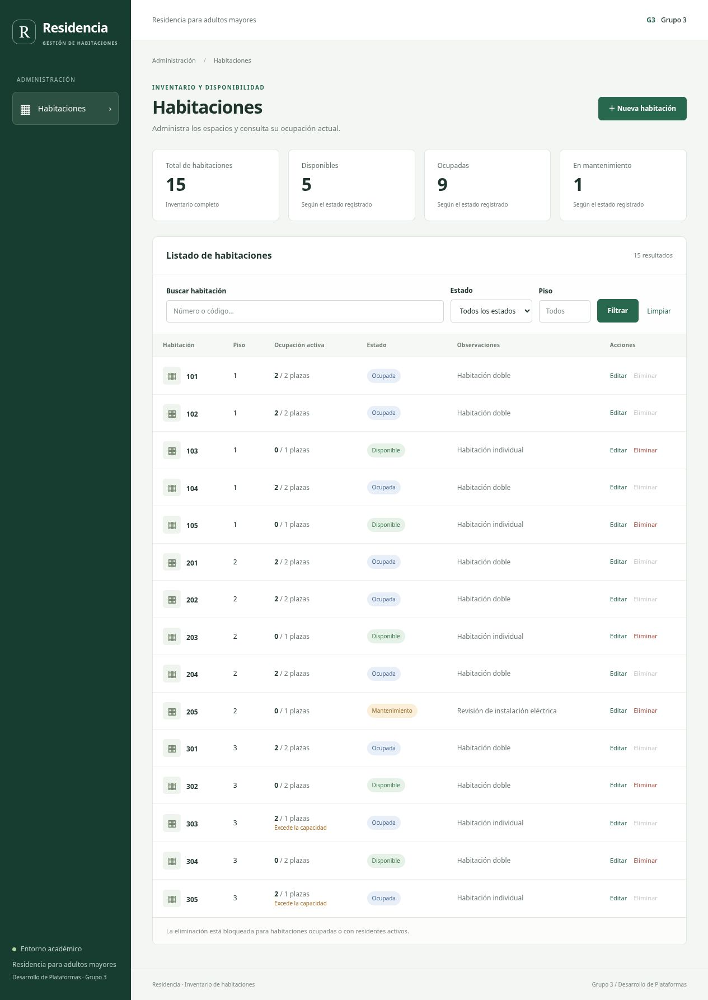
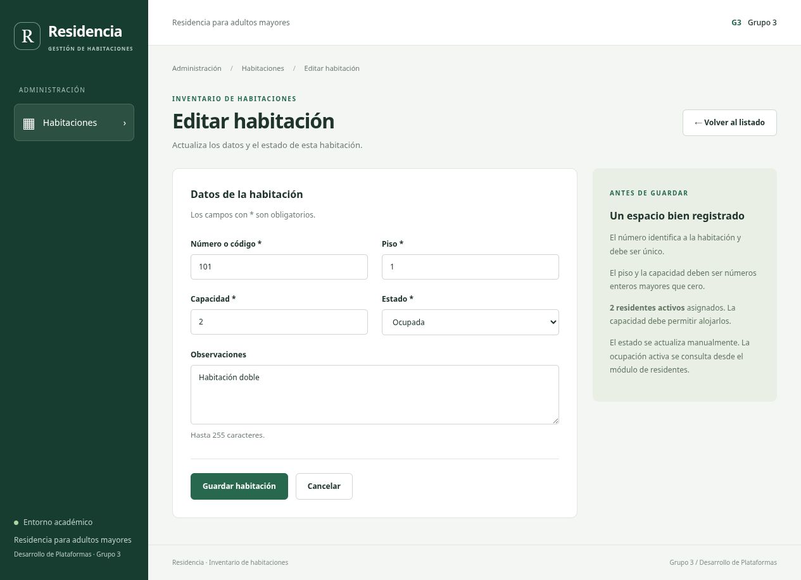

# Sistema de Gestión de Residencia para Adultos Mayores

## Módulo de Habitaciones · Grupo 3

**Proyecto académico del curso Desarrollo de Plataformas.**

Una aplicación web para organizar las habitaciones de una residencia para adultos mayores. Permite registrar espacios, consultar su disponibilidad, actualizar sus datos y controlar su eliminación según la ocupación registrada.

## Objetivo del proyecto

Facilitar la consulta y el mantenimiento del inventario de habitaciones, reuniendo en una sola pantalla su número, piso, capacidad, estado y cantidad de residentes activos asignados. Esta información ayuda al personal a identificar los espacios disponibles y las habitaciones que requieren atención.

## ¿Qué permite hacer?

| Función | Descripción |
| --- | --- |
| Registrar habitaciones | Agregar número o código, piso, capacidad, estado y observaciones. |
| Consultar el inventario | Visualizar las habitaciones y la cantidad de residentes activos asignados. |
| Buscar y filtrar | Buscar por número o código y filtrar por piso o estado. |
| Actualizar información | Editar los datos de una habitación y cambiar su estado. |
| Eliminar con validaciones | Eliminar habitaciones únicamente cuando no estén marcadas como ocupadas ni tengan residentes activos asignados. |

Los estados disponibles son **Disponible**, **Ocupada** y **Mantenimiento**. El estado se actualiza manualmente; la cantidad de residentes activos se consulta en la base de datos.

## Recorrido por la aplicación

1. **Consultar:** abrir el listado para revisar las habitaciones y sus estados.
2. **Registrar:** completar el formulario de una nueva habitación y guardar los datos.
3. **Localizar:** utilizar la búsqueda y los filtros para encontrar el registro.
4. **Actualizar:** editar su información o cambiar su estado cuando corresponda.
5. **Eliminar:** confirmar la eliminación de una habitación que cumpla las condiciones establecidas.

## Reglas de funcionamiento

- Cada habitación debe tener un número o código único de hasta 10 caracteres.
- El piso y la capacidad deben ser números enteros mayores que cero.
- Las observaciones son opcionales y admiten hasta 255 caracteres.
- La capacidad no puede reducirse por debajo de la cantidad de residentes activos asignados.
- No se permite eliminar una habitación ocupada o con residentes activos asignados.
- La aplicación informa los errores de validación y confirma las operaciones realizadas.

## Correcciones y mejoras de la entrega

La entrega incorpora la versión corregida del script de la base de datos y ajustes en el módulo respecto de la versión anterior:

- **Datos iniciales:** el script incluido contiene una única carga de incidentes e identifica como corregido el registro del 8 de septiembre. Se conserva la estructura de tablas del proyecto del curso.
- **Conexión a la base de datos:** se reemplazó la conexión anterior, que dependía de `global.php` y utilizaba MySQLi, por una conexión PDO con configuración local independiente.
- **Validación de habitaciones:** se comprueban los códigos duplicados, los campos obligatorios, la capacidad, el piso y los estados permitidos.
- **Protección de la ocupación:** se impide reducir la capacidad por debajo de los residentes activos asignados y eliminar habitaciones ocupadas o con residentes activos.
- **Observaciones:** se corrigió la conservación y visualización del texto `0` en este campo.
- **Operaciones y mensajes:** se incorporaron consultas parametrizadas, protección de formularios y mensajes de confirmación o error.

Estas mejoras no implican una depuración completa de los datos originales. Las habitaciones 303 y 305 conservan una capacidad de una persona y dos residentes activos asignados en los datos de ejemplo; el módulo muestra advertencias y no modifica esas asignaciones automáticamente.

## Vista del módulo

### Listado de habitaciones

Consulta del inventario y acceso a las operaciones del módulo.



### Edición de una habitación

Formulario para actualizar la información de una habitación.



*Capturas de referencia incluidas en el repositorio.*

## Tecnologías utilizadas

| Tecnología | Uso en el proyecto |
| --- | --- |
| PHP 8.x | Procesamiento de solicitudes y reglas de negocio. |
| PDO MySQL | Conexión a la base de datos y consultas parametrizadas. |
| MySQL / MariaDB | Almacenamiento de habitaciones y consulta de residentes. |
| HTML y CSS | Formularios, listado y presentación visual. |
| Apache / XAMPP | Ejecución de la aplicación en un entorno local. |

El código está organizado en modelos, controladores y vistas. Los formularios incorporan validación en el servidor y protección CSRF; las operaciones de actualización y eliminación utilizan transacciones.

## Ejecutar el proyecto en un equipo local

### Requisitos

- XAMPP con Apache y MySQL/MariaDB.
- PHP 8.x con las extensiones `pdo_mysql` y `mbstring`.
- Un navegador web.

### Instalación

1. Copiar el proyecto dentro de la carpeta `htdocs` de XAMPP con el nombre `sistema-gestion-adultos-mayores-grupo3`.
2. Iniciar Apache y MySQL desde XAMPP.
3. En una instalación nueva, importar [`database/sistema_residencia.sql`](database/sistema_residencia.sql) desde phpMyAdmin.
   **Atención:** el archivo elimina y vuelve a crear la base `sistema_residencia`. No importarlo sobre una base con información que se deba conservar.
4. Copiar [`config/database.example.php`](config/database.example.php) como `config/database.local.php` y completar los datos de conexión para el usuario `residencia_app` creado por el script SQL.
5. Abrir la aplicación en el navegador:

   ```text
   http://localhost/sistema-gestion-adultos-mayores-grupo3/
   ```

El archivo `config/database.local.php` contiene la configuración privada de cada equipo y no debe publicarse en el repositorio. La aplicación debe ejecutarse con PHP y Apache; Live Server no procesa archivos PHP.

## Alcance de la entrega

Esta entrega corresponde al **módulo de gestión de habitaciones desarrollado por el Grupo 3**. La tabla de residentes se consulta para calcular la ocupación y aplicar las validaciones; la gestión de residentes pertenece a otro módulo.

La demostración está configurada para acceso local mediante `.htaccess`. La autenticación y los permisos por rol deben integrarse con el módulo correspondiente antes de habilitar el acceso público a la aplicación.

## Estructura del proyecto

```text
config/         Configuración y conexión a la base de datos
controladores/  Procesamiento de solicitudes
modelos/        Consultas y reglas de negocio
vistas/         Pantallas del módulo
includes/       Utilidades y componentes compartidos
public/         Estilos de la aplicación
database/       Script de la base de datos
docs/           Capturas de referencia
tests/          Pruebas de integración del modelo
index.php       Entrada a la aplicación
```

## Integrantes

- Miguel Angel Marreros Cortegana
- Salon Ynga Dangelo Emanuel
- Jhenuar Chichipe Huaman
- Rayan Emilio Loja Alvarado
- Jean Frank Bustamante Vela
- Johan Perez Silva
- Edgar Heiner Jauregui Epiquien

**Curso:** Desarrollo de Plataformas

**Equipo:** Grupo 3

**Entrega:** Módulo de Habitaciones
