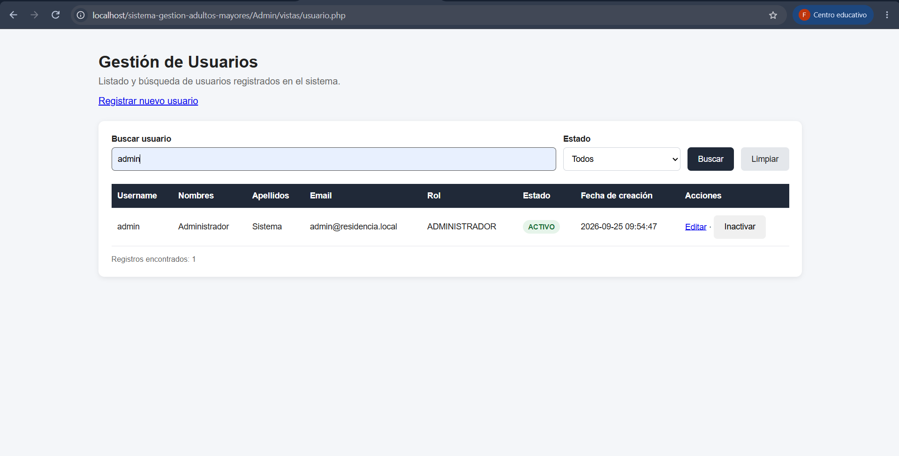
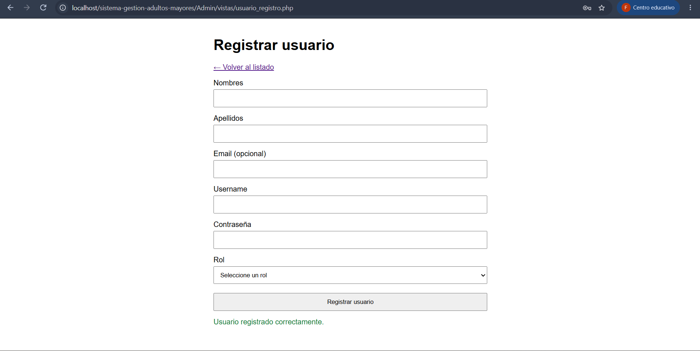
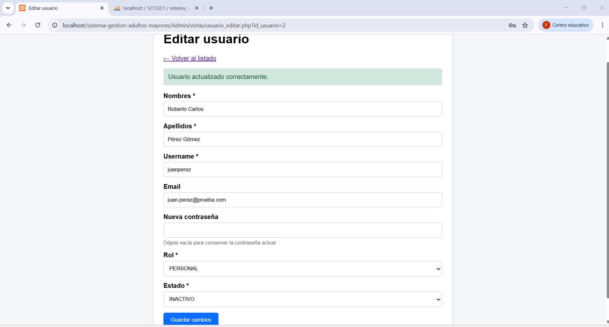
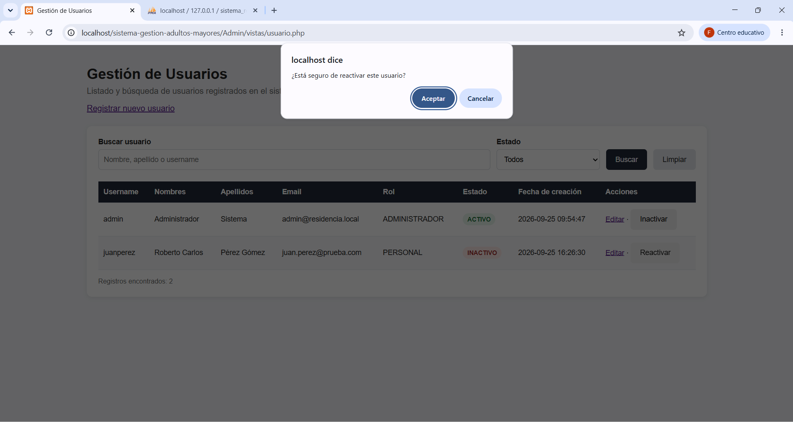

# Sistema de Gestión de Residencia para Adultos Mayores

## Grupo 1 — Usuarios y Roles

Módulo desarrollado para el curso **Desarrollo de Plataformas**.

El Grupo 1 implementa el CRUD de usuarios del sistema. La tabla `roles`
se utiliza únicamente como catálogo para asignar un rol existente a cada
usuario mediante una lista desplegable.

El alcance del módulo no incluye login, autenticación, sistema de permisos
ni CRUD de roles.

---

## Integrantes

1. Roberto Ynga Vargas
2. Leydi Puerta Culqui
3. Lilian Janet Huaman Huaman
4. Frank Salon Trigoso
5. Valentín Fernández Campos
6. Jheison Ramos Becerra

---

## Repositorio

Repositorio oficial:

https://github.com/danielalva2008/sistema-gestion-adultos-mayores

Rama de integración del Grupo 1:

`dev/grupo1`

---

## Alcance del módulo

El módulo permite:

- registrar usuarios;
- listar usuarios;
- buscar usuarios por nombres, apellidos o username;
- filtrar usuarios por estado;
- editar información del usuario;
- cambiar el rol asignado;
- cambiar opcionalmente la contraseña;
- inactivar usuarios mediante baja lógica;
- reactivar usuarios inactivos.

La tabla `roles` se consulta como catálogo de apoyo.

No se implementa:

- CRUD de roles;
- login;
- logout;
- autenticación;
- permisos por rol;
- eliminación física de usuarios como operación normal.

---

## Tablas utilizadas

### `usuarios`

Tabla principal del módulo.

Campos principales:

- `id_usuario`
- `id_rol`
- `username`
- `password_hash`
- `nombres`
- `apellidos`
- `email`
- `estado`
- `fecha_creacion`

### `roles`

Tabla auxiliar utilizada como catálogo.

Cada usuario debe tener un `id_rol` válido existente en esta tabla.

Los roles iniciales del proyecto son:

- `ADMINISTRADOR`
- `SUPERVISOR`
- `PERSONAL`

No se implementa CRUD sobre esta tabla.

---

# Historias de usuario

## HU-01 — Registrar usuario

**Como administrador**, quiero registrar un nuevo usuario indicando su rol,
para mantener las cuentas del sistema correctamente registradas y asociadas
a un rol.

El registro valida:

- campos obligatorios;
- unicidad de `username`;
- unicidad del email cuando se proporciona;
- formato de email;
- existencia del rol;
- almacenamiento de la contraseña mediante hash.

---

## HU-02 — Listar y buscar usuarios

**Como administrador**, quiero listar y buscar usuarios por nombre,
username o estado, para ubicarlos rápidamente.

La interfaz permite:

- mostrar todos los usuarios;
- buscar por nombres;
- buscar por apellidos;
- buscar por username;
- filtrar por `ACTIVO`;
- filtrar por `INACTIVO`;
- combinar búsqueda y estado.

---

## HU-03 — Editar usuario

**Como administrador**, quiero editar los datos de un usuario y cambiar
su rol o estado, para mantener la información actualizada.

Se permite modificar:

- nombres;
- apellidos;
- username;
- email;
- rol;
- estado;
- contraseña de manera opcional.

Si no se introduce una nueva contraseña, se conserva el hash existente.

---

## HU-04 — Inactivar y reactivar usuario

**Como administrador**, quiero inactivar un usuario mediante baja lógica
en lugar de eliminarlo físicamente, para conservar el registro de la cuenta.

La inactivación cambia:

`ACTIVO → INACTIVO`

El registro permanece almacenado en `usuarios`.

También se permite:

`INACTIVO → ACTIVO`

---

# Reglas de negocio principales

- `username` debe ser único.
- El email es opcional, pero si se proporciona debe tener formato válido y
  ser único.
- Cada usuario debe tener exactamente un rol existente.
- Los roles se cargan desde la tabla `roles`.
- La contraseña nunca se almacena en texto plano.
- El estado permitido es `ACTIVO` o `INACTIVO`.
- La baja se realiza modificando el estado y no mediante `DELETE`.
- La fecha de creación es generada automáticamente por MySQL.
- Las operaciones utilizan consultas preparadas mediante PDO.

---

# Requisitos técnicos

Para ejecutar el proyecto se requiere:

- Apache
- PHP 8.x
- MySQL 8.x o entorno compatible de XAMPP
- PDO MySQL habilitado
- Git
- navegador web

El proyecto fue desarrollado utilizando XAMPP.

---

# Instalación

## 1. Clonar el repositorio

```bash
git clone https://github.com/danielalva2008/sistema-gestion-adultos-mayores.git

```

Ingresar al proyecto:

```bash
cd sistema-gestion-adultos-mayores
```

Cambiar a la rama del Grupo 1:

```bash
git checkout dev/grupo1
```

---

## 2. Ubicar el proyecto en XAMPP

El proyecto debe encontrarse dentro del directorio servido por Apache.

Ejemplo utilizado durante el desarrollo:

```text
/opt/lampp/htdocs/sistema-residencia
```

La ubicación puede variar según el sistema operativo y la instalación de XAMPP.

---

# Base de datos

## 3. Importar `database.sql`

1. Iniciar Apache y MySQL/MariaDB desde XAMPP.
2. Abrir phpMyAdmin.
3. Importar el archivo oficial `database.sql`.
4. Verificar la creación de la base de datos `sistema_residencia`.
5. Verificar que existan las tablas `usuarios` y `roles`.

No se debe modificar el esquema proporcionado por el docente.

---

# Configuración de la conexión

La conexión PDO utilizada por el módulo se encuentra en:

```text
Admin/Config/ConexionPDO.php
```

La configuración utiliza:

```text
Host: localhost
Base de datos: sistema_residencia
Usuario MySQL: residencia_app
```

Las credenciales deben coincidir con las definidas para el proyecto.

El CRUD utiliza la cuenta técnica `residencia_app` y no `root`.

---

# Ejecución

Con Apache y la base de datos activos, abrir en el navegador:

```text
http://localhost/sistema-residencia/Admin/vistas/usuario.php
```

Desde esta pantalla se puede acceder a las operaciones principales del CRUD de usuarios.

---

# Estructura principal del módulo

```text
Admin/
├── Config/
│   └── ConexionPDO.php
├── modelos/
│   └── Usuario.php
├── ajax/
│   └── usuario.php
└── vistas/
    ├── usuario.php
    ├── usuario_registro.php
    └── usuario_editar.php
```

`usuario.php` contiene el listado, búsqueda, filtros y acciones sobre usuarios.

`usuario_registro.php` contiene el formulario de registro.

`usuario_editar.php` contiene el formulario de edición.

`Admin/ajax/usuario.php` procesa las operaciones solicitadas por las vistas.

`Admin/modelos/Usuario.php` contiene las operaciones de acceso a datos.

`Admin/Config/ConexionPDO.php` contiene la conexión mediante PDO.

---

# Evidencias de funcionamiento

Las siguientes capturas muestran las principales operaciones implementadas
en el CRUD de usuarios.

## Listado y búsqueda

La interfaz permite visualizar los usuarios registrados y utilizar los
criterios de búsqueda y filtrado disponibles.



## Registro de usuario

Evidencia del proceso de registro de un nuevo usuario en el sistema.



## Edición de usuario

Evidencia de la actualización de los datos de un usuario registrado.



## Inactivación y reactivación

Evidencia del manejo del estado del usuario mediante baja lógica,
manteniendo el registro almacenado en la base de datos.




---

# Pruebas

El plan detallado de pruebas del Grupo 1 se encuentra en:

```text
docs/grupo1/05_pruebas.md
```

El documento incluye los casos funcionales `CP-01` a `CP-38` y las pruebas técnicas `PT-01` a `PT-05`.

---

# Documentación adicional

La documentación funcional y técnica del Grupo 1 se encuentra en:

```text
docs/grupo1/
```

Documentos principales:

- `01_requisitos.md`
- `03_modelo_datos.md`
- `03_reglas_negocio.md`
- `05_pruebas.md`
- `06_decisiones.md`
- `07_onboarding_y_reparto_equipo.md`
- `08_preparacion_tecnica.md`
- `Manual_Maestro_Proyecto_Grupo1.md`

---

# Pull Request

La entrega final del módulo se realiza mediante un Pull Request desde:

```text
dev/grupo1
```

hacia:

```text
main
```

El enlace al Pull Request final se añadirá en esta sección cuando se encuentre preparado para revisión.

---

## Curso

**Desarrollo de Plataformas**

Sistema de Gestión de Residencia para Adultos Mayores — 2026.