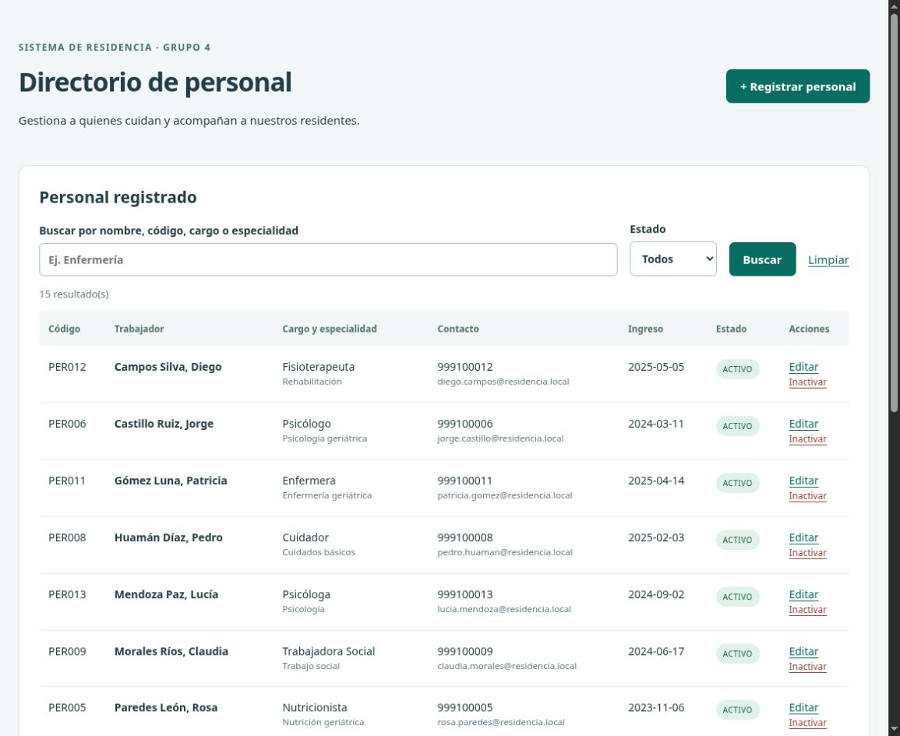
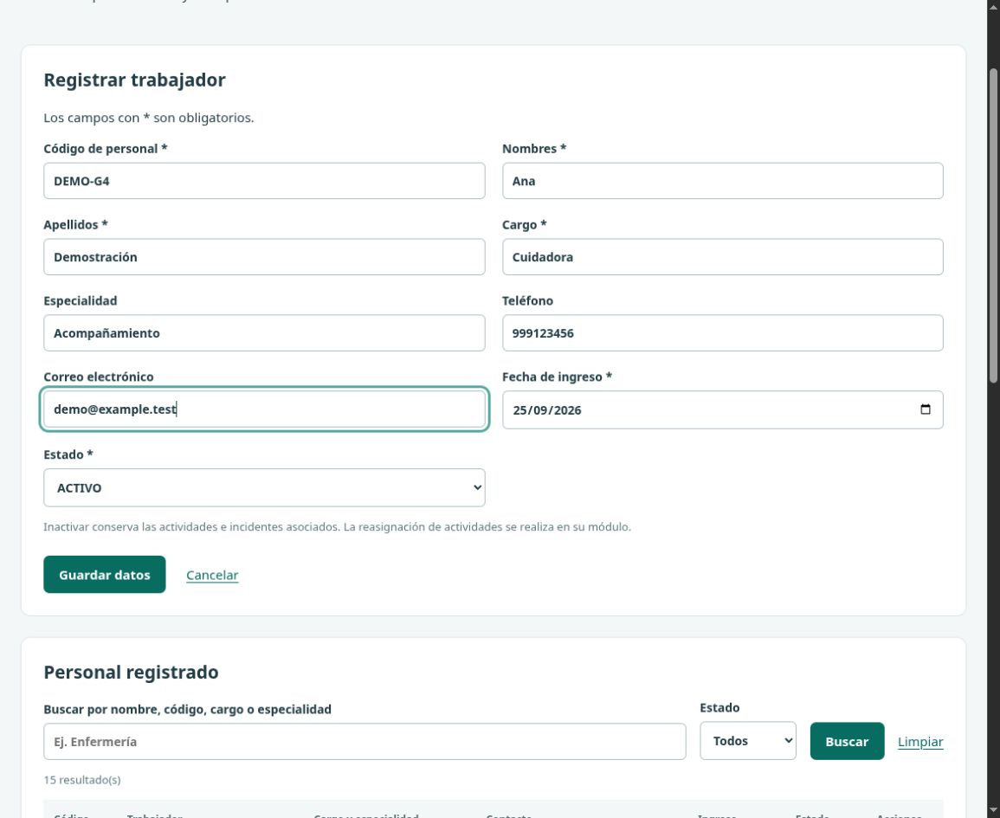
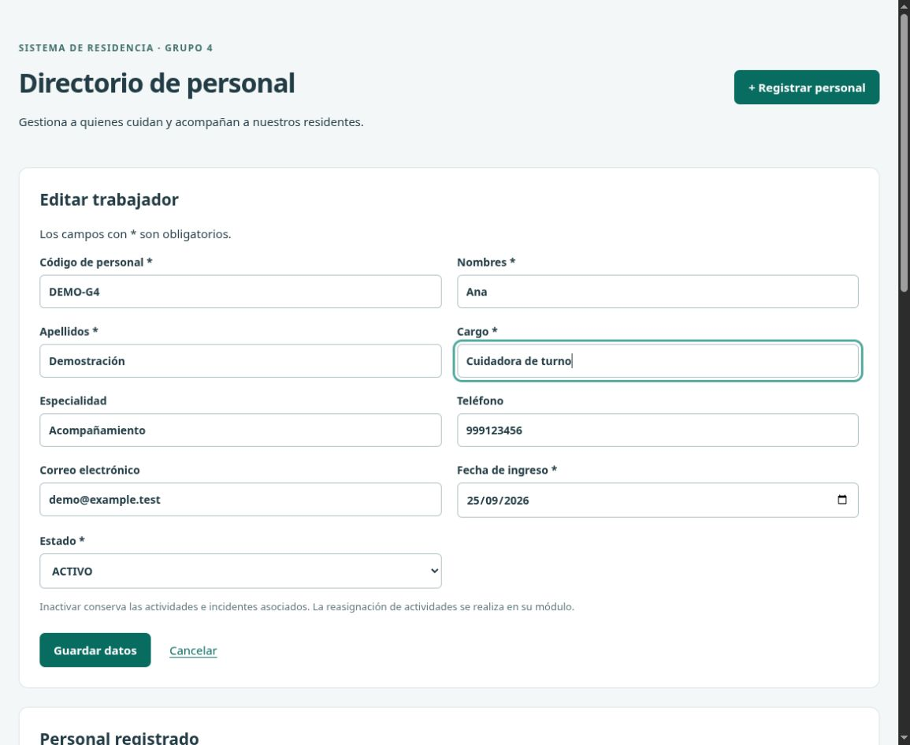
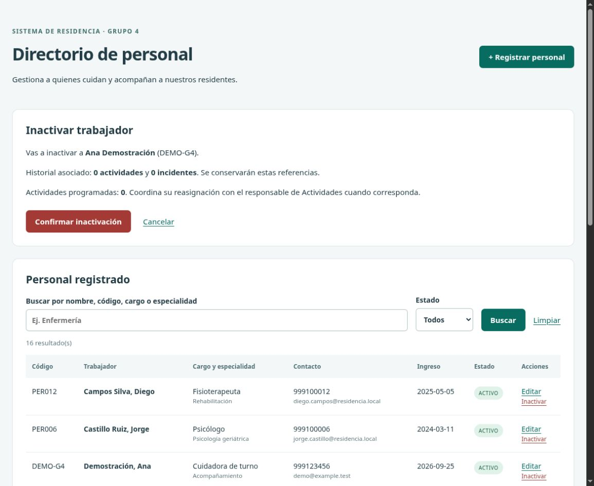
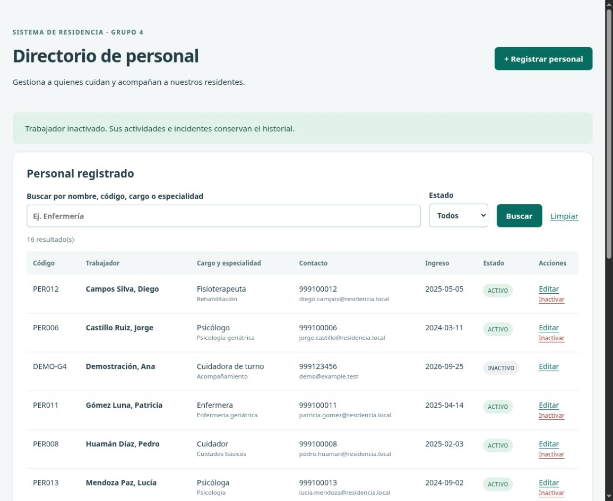
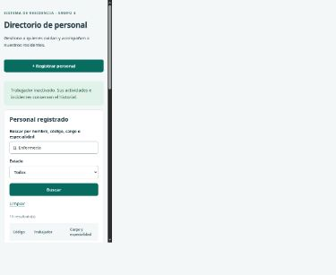

# Módulo Personal — Grupo 4

Registra, consulta, edita e inactiva al personal de la residencia. La baja cambia el estado a INACTIVO y conserva las referencias de actividades e incidentes.

Rama de trabajo: `feature/grupo-4-personal`, conforme al documento de la actividad. Grupo 4: Personal.

## Integrantes

- Santillan Valle Jhon Kelvin
- Salazar Salazar Luis Grimaldo
- Maria Carmen Tuesta Chuquizuta
- Ramos Ocampo Kevin

## Historias implementadas

- Como administrador, registrar personal con código, nombres, apellidos, cargo, especialidad y contacto.
- Como supervisor, buscar por cargo o especialidad y filtrar por estado.
- Como administrador, editar los datos del directorio.
- Como administrador, inactivar colaboradores conservando su historial.

Estas historias describen los actores previstos. Esta versión es una demostración local independiente: la autenticación y los permisos por rol deben integrarse con el módulo Usuarios del Grupo 1 cuando se acuerde su interfaz de sesión.

## Organización

- `config.php`: conexión PDO mediante el usuario de aplicación.
- `model.php`: consultas preparadas y validaciones.
- `index.php`: gestión de solicitudes, sesión, token CSRF y mensajes.
- `view.php` y `style.css`: formularios y listado adaptable.
- `database-inicial.sql`: base académica para una instalación nueva.
- `test.php`: pruebas de integración por terminal, con reversión de cambios.

## Abrir en Visual Studio Code y GitHub Desktop

La carpeta del repositorio es la misma para ambas herramientas. En GitHub Desktop, `Current Branch` debe mostrar `feature/grupo-4-personal`. En `History` aparecen los commits; `Changes` muestra únicamente modificaciones aún no guardadas en un commit.

En Visual Studio Code, abrir la carpeta completa `sistema-gestion-adultos-mayores`. Elegir **Terminal → Run Task → Personal: iniciar entorno local**. La tarea abre la demostración en http://127.0.0.1:8084. También puede iniciarse desde la terminal del proyecto:

```bash
bash personal/dev.sh
```

El iniciador utiliza PHP y MariaDB de XAMPP en Linux, prepara una instancia separada con datos ficticios la primera vez y conserva sus datos en `personal/.local/`, excluida de Git. No modifica las bases del servicio principal de XAMPP. `Ctrl+C` detiene el entorno. Para ejecutar las pruebas, detener primero la demostración y elegir la tarea **Personal: ejecutar pruebas**, o ejecutar:

```bash
bash personal/dev.sh test
```

Esta modalidad facilita la demostración en la laptop sin permisos de administrador. Para la instalación común del curso, usar las instrucciones siguientes y el servicio de base de datos acordado por el docente.

## Base de datos

Tabla principal: `personal`. Se conservan las relaciones con `actividades.id_personal_responsable` e `incidentes.id_personal_reporta` porque nunca se elimina físicamente al trabajador. La reasignación de actividades pendientes corresponde al módulo Actividades.

El SQL procede del commit `6a94b63` de `feature/grupo-5-incidentes`. Se eliminó `DROP DATABASE` y se completó con NULL el responsable ausente del octavo incidente. El script crea una base nueva y debe ejecutarse sin la opción `--force`, para detenerse si ya existe. No importarlo sobre una instalación con información existente. Si el docente facilita una versión definitiva, utilizar esa versión.

Con MySQL de XAMPP iniciado, desde la raíz del repositorio:

```bash
/opt/lampp/bin/mysql -u root -p < personal/database-inicial.sql
```

La cuenta administrativa se usa solo para preparar el esquema. El módulo usa `residencia_app`.

## Ejecutar

Se requiere PHP 8.x con `pdo_mysql` y `mbstring`. El valor inicial de conexión corresponde al usuario académico del SQL: `residencia_app`, clave `Residencia2026*`, base `sistema_residencia`, host `127.0.0.1`, puerto `3306`.

Las variables `PERSONAL_DB_HOST`, `PERSONAL_DB_PORT`, `PERSONAL_DB_NAME`, `PERSONAL_DB_USER`, `PERSONAL_DB_PASSWORD` y `PERSONAL_DB_SOCKET` permiten cambiar la configuración sin editar archivos compartidos. No agregar credenciales reales al repositorio.

```bash
/opt/lampp/bin/php -S 127.0.0.1:8084 -t personal personal/router.php
```

Abrir http://127.0.0.1:8084. El servidor se limita a la laptop para esta demostración académica.

## Pruebas

En una base académica con el SQL importado:

```bash
/opt/lampp/bin/php personal/test.php
```

El test revierte sus escrituras mediante una transacción. Comprueba creación, lectura, edición, búsqueda, duplicados, validación de fecha/correo/teléfono/estado/longitud y conservación de las referencias al inactivar. Debe ejecutarse sobre datos de prueba, ya que utiliza los catálogos académicos de residentes y tipos de incidente.

Validación realizada con PHP 8.2.12 y MariaDB 10.4.32 incluida en XAMPP. MySQL 8 no está instalado en este entorno: queda pendiente comprobarlo si el docente lo exige específicamente.

## Recorrido para la sustentación

1. Mostrar el listado y buscar una especialidad.
2. Registrar un trabajador ficticio con un código nuevo.
3. Intentar repetir el código para demostrar la validación.
4. Editar teléfono, cargo o especialidad.
5. Abrir Inactivar, revisar la confirmación y confirmar.
6. Filtrar INACTIVO y comprobar que el registro se conserva.
7. Explicar las consultas preparadas, la baja lógica y el token de formulario.

## Capturas del CRUD funcionando

Capturas obtenidas en la demostración local con información ficticia. `DEMO-G4` es un registro creado para este recorrido y no forma parte del SQL inicial.

### Listado y búsqueda



### Registro



### Edición



### Confirmación y efecto de la baja





### Pantalla pequeña



## Correspondencia con la actividad

| Requisito | Implementación o evidencia |
| --- | --- |
| Registrar personal con cargo y especialidad | Formulario y consulta INSERT preparada |
| Listar y buscar por cargo o especialidad | Tabla HTML, búsqueda y filtro por estado |
| Editar contacto y estado | Formulario precargado y consulta UPDATE preparada |
| Baja lógica e historial | Cambio a INACTIVO sin DELETE; pruebas de referencias |
| Código único | Validación previa y restricción UNIQUE de la base |
| PHP 8 y PDO | Probado con PHP 8.2.12 y pdo_mysql |
| Usuario de aplicación | residencia_app para las operaciones del módulo |
| MySQL 8 | Pendiente de validación en ese motor; XAMPP local incluye MariaDB 10.4.32 |
| Organización y presentación | Conexión, modelo, controlador, vista y CSS separados |
| Documentación e historias | Este README, integrantes y capturas |
| Trabajo con Git | Rama asignada y commits descriptivos |
| Pull Request | Enlace de entrega registrado al crear la solicitud |

## Pendientes de entrega

La autenticación común depende del módulo Usuarios. El Pull Request debe apuntar a `main`; su aprobación e integración corresponden al responsable del repositorio. La sustentación y la revisión cruzada de otro grupo se realizan con participación del equipo.
