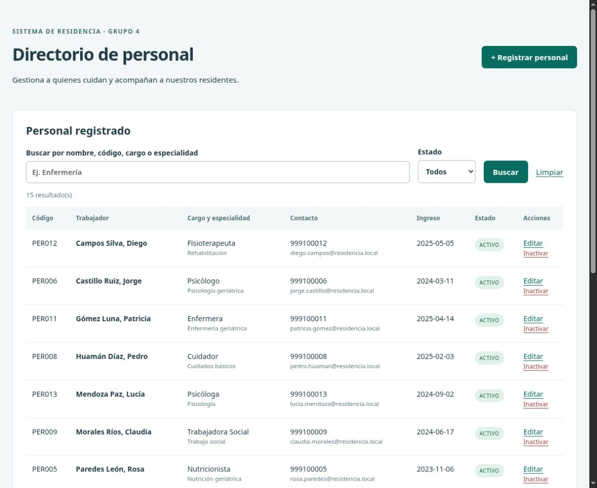
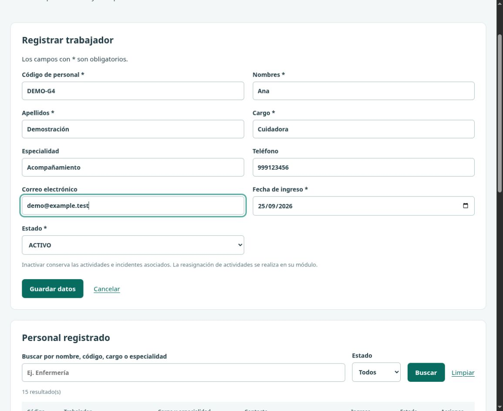
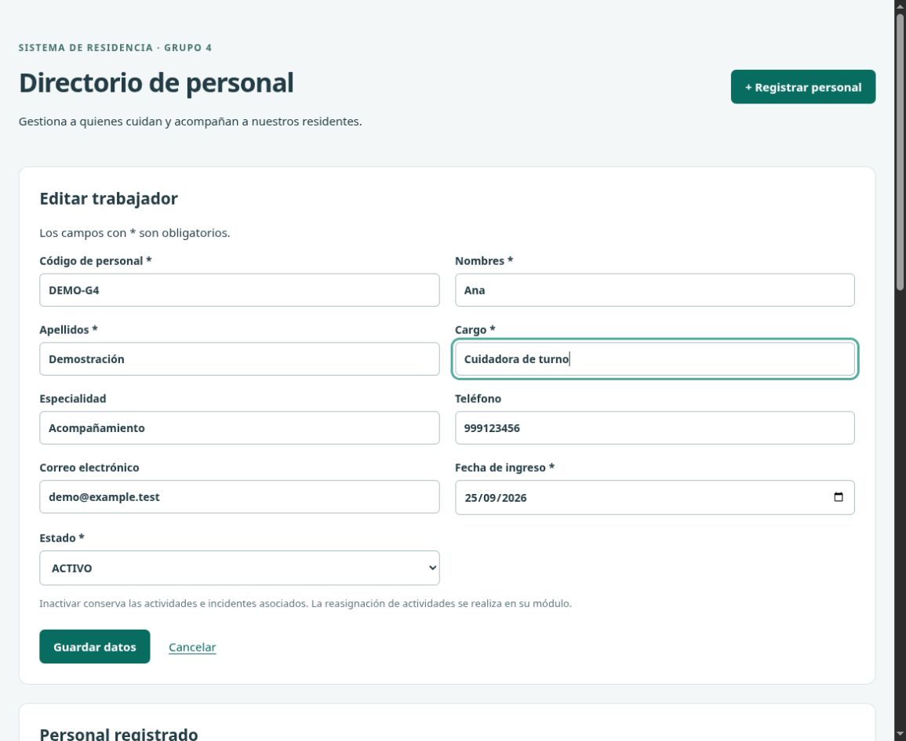
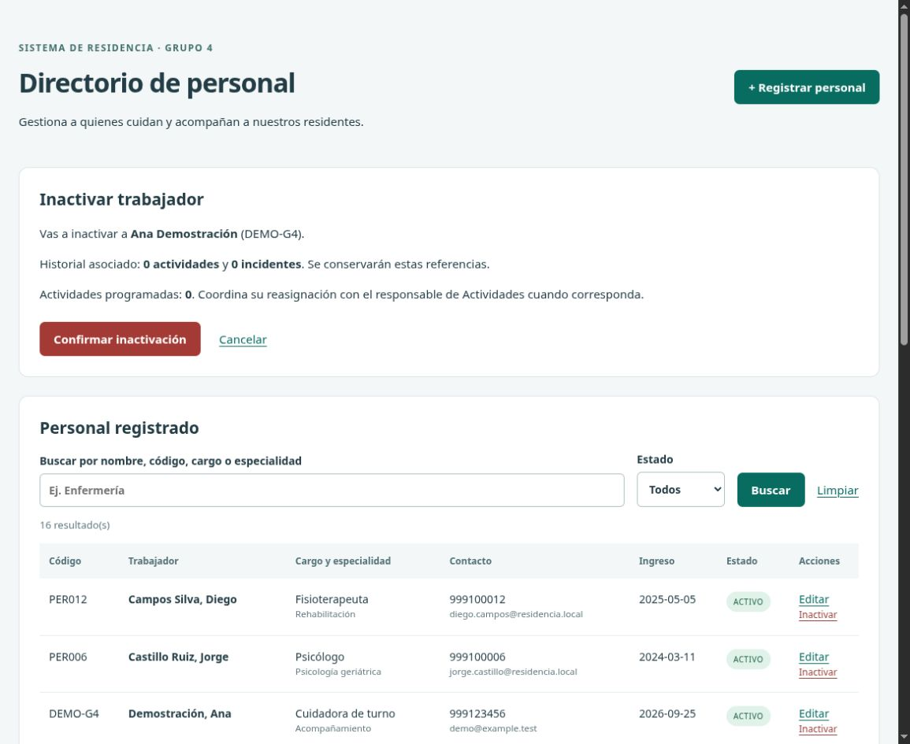
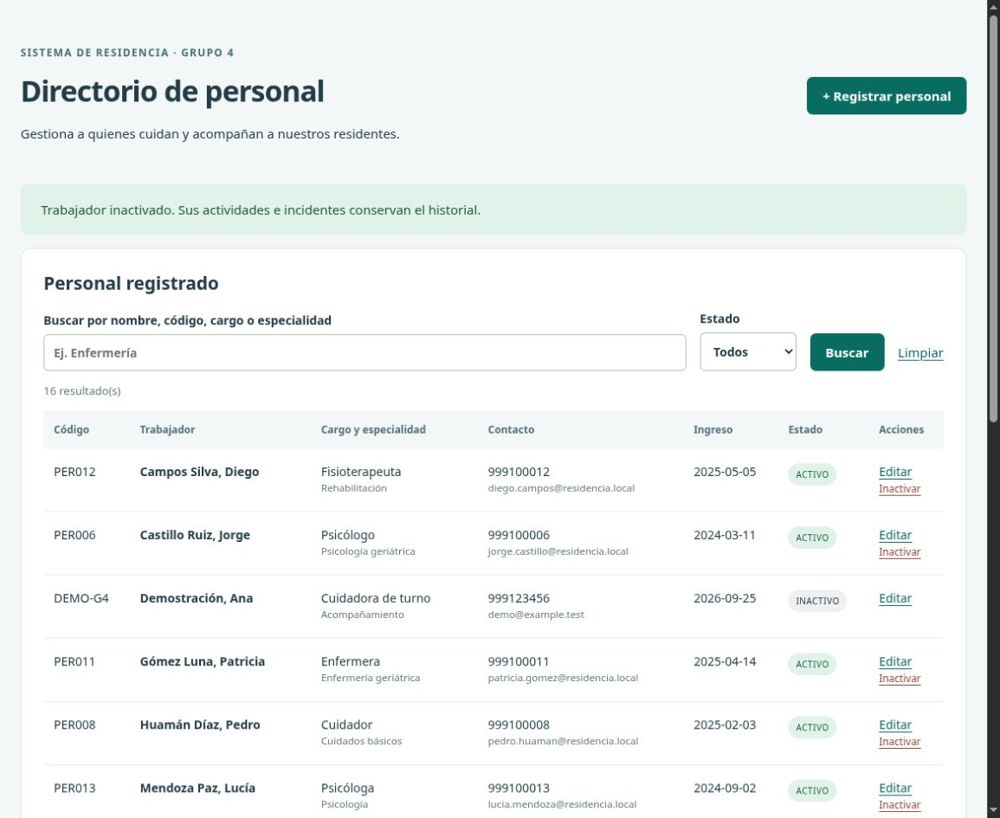
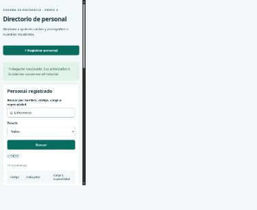

# Sistema de Gestión para Residencia de Adultos Mayores

## Módulo de Gestión de Personal — Grupo 4

**Curso:** Desarrollo de Plataformas Web  
**Módulo asignado:** Gestión de Personal  
**Rama:** `feature/grupo-4-personal`

### Integrantes

- Santillán Valle Jhon Kelvin
- Salazar Salazar Luis Grimaldo
- María Carmen Tuesta Chuquizuta
- Ramos Ocampo Kevin

---

## 1. Resumen ejecutivo

El módulo de Gestión de Personal centraliza la información laboral y de contacto de los colaboradores de la residencia. Permite registrar, consultar, buscar, editar e inactivar trabajadores, conservando el historial institucional cuando una persona deja de prestar servicios.

La inactivación se implementa mediante una baja lógica: el registro cambia al estado `INACTIVO` y permanece en la base de datos. De este modo, las actividades y los incidentes mantienen la referencia del trabajador responsable.

La solución utiliza PHP 8, PDO, MySQL/MariaDB, HTML5 y CSS3. Incluye validaciones en el servidor, consultas preparadas, protección CSRF, control de códigos duplicados y una interfaz adaptable.

## 2. Problemática

La residencia requiere información confiable sobre las personas que participan en su operación. Un registro disperso dificulta localizar colaboradores, consultar su cargo o especialidad y mantener actualizados sus datos.

La eliminación física de un trabajador también podría afectar el historial de actividades e incidentes. El módulo resuelve esta necesidad mediante un directorio centralizado y una baja lógica que preserva la integridad de las relaciones.

## 3. Objetivos

### 3.1 Objetivo general

Desarrollar un módulo web seguro y funcional para administrar la información del personal, garantizando la integridad de los datos y la conservación de sus relaciones históricas.

### 3.2 Objetivos específicos

- Registrar colaboradores con información laboral y de contacto.
- Consultar el directorio mediante búsqueda y filtrado por estado.
- Actualizar la información de trabajadores existentes.
- Inactivar personal sin eliminar registros relacionados.
- Prevenir códigos duplicados y formatos inválidos.
- Proteger las operaciones con consultas preparadas y token CSRF.
- Verificar el flujo CRUD mediante pruebas integrales.

## 4. Alcance funcional

El módulo cubre las siguientes operaciones:

1. Registro de personal.
2. Listado del directorio.
3. Búsqueda por código, nombre, cargo o especialidad.
4. Filtrado por estado `ACTIVO` o `INACTIVO`.
5. Edición de información laboral y de contacto.
6. Consulta del impacto de una baja sobre actividades e incidentes.
7. Inactivación con conservación del historial.

La autenticación general y la administración global de permisos corresponden al módulo de Usuarios.

## 5. Historias de usuario

- **Registro:** Como administrador, quiero registrar al personal con su cargo y especialidad para asignarlo posteriormente a actividades o incidentes.
- **Consulta:** Como supervisor, quiero buscar personal por cargo o especialidad para localizar a un responsable disponible.
- **Actualización:** Como administrador, quiero editar los datos de contacto y el estado para mantener actualizado el directorio.
- **Baja lógica:** Como administrador, quiero inactivar a quien ya no trabaja en la residencia para conservar su historial.

## 6. Organización del código

El proyecto separa configuración, control, modelo, vista, recursos públicos, base de datos, pruebas y scripts de ejecución.

```text
personal/
├── config/
│   └── database.php
├── controllers/
│   └── personal_controller.php
├── models/
│   └── personal_model.php
├── views/
│   └── personal_view.php
├── public/
│   └── css/
│       └── style.css
├── database/
│   └── database.sql
├── tests/
│   └── personal_integration_test.php
├── scripts/
│   └── dev.sh
├── capturas/
├── index.php
├── router.php
├── crear.php
├── guardar.php
├── editar.php
├── actualizar.php
└── inactivar.php
```

| Carpeta o archivo | Responsabilidad |
| --- | --- |
| `config/database.php` | Configuración y conexión PDO |
| `controllers/personal_controller.php` | Procesamiento de solicitudes, sesión, CSRF y mensajes |
| `models/personal_model.php` | Consultas preparadas, reglas y validaciones |
| `views/personal_view.php` | Formularios, filtros y listado HTML |
| `public/css/style.css` | Presentación y diseño adaptable |
| `database/database.sql` | Esquema y datos académicos |
| `tests/personal_integration_test.php` | Pruebas integrales con reversión |
| `scripts/dev.sh` | Inicio del entorno local y ejecución de pruebas |
| `index.php` | Punto de entrada principal |

Los archivos `crear.php`, `guardar.php`, `editar.php`, `actualizar.php` e `inactivar.php` son entradas pequeñas de compatibilidad. Toda la lógica se concentra en el controlador y el modelo.

## 7. Modelo de datos

La tabla principal es `personal`. El campo `codigo_personal` es único y el campo `estado` admite los valores `ACTIVO` e `INACTIVO`.

El módulo conserva las relaciones con `actividades.id_personal_responsable` e `incidentes.id_personal_reporta`. La inactivación no ejecuta una eliminación física, por lo que las referencias históricas permanecen disponibles.

## 8. Seguridad y validaciones

- PDO con consultas parametrizadas.
- Validación de campos obligatorios y longitudes máximas.
- Control del formato de correo y teléfono.
- Verificación de fecha de ingreso y estado permitido.
- Verificación previa y restricción única para el código.
- Token CSRF para operaciones que modifican información.
- Escape del contenido presentado en la vista.
- Usuario de aplicación `residencia_app` para las operaciones del módulo.

## 9. Requisitos y ejecución local

Se requiere PHP 8.x con `pdo_mysql` y `mbstring`, además de MySQL 8 o MariaDB compatible.

En Visual Studio Code, abrir la carpeta completa del repositorio y seleccionar:

**Terminal → Run Task → Personal: iniciar entorno local**

También puede iniciarse desde la raíz del repositorio:

```bash
bash personal/scripts/dev.sh
```

Luego abrir [http://127.0.0.1:8084](http://127.0.0.1:8084). El entorno académico aislado conserva sus datos en `personal/.local/`, carpeta excluida de Git.
En el primer inicio se genera una clave aleatoria para `residencia_app` en esa carpeta local; no se publica junto con el proyecto.

### Instalación con el script académico

Para una base nueva:

```bash
/opt/lampp/bin/mysql -u root -p < personal/database/database.sql
```

Para una instalación manual, el administrador debe crear `residencia_app` con permisos `SELECT`, `INSERT`, `UPDATE` y `DELETE` sobre `sistema_residencia.*` y definir `PERSONAL_DB_PASSWORD` en el entorno. El módulo también admite `PERSONAL_DB_HOST`, `PERSONAL_DB_PORT`, `PERSONAL_DB_NAME`, `PERSONAL_DB_USER` y `PERSONAL_DB_SOCKET` para ajustar la conexión sin modificar el código. La clave no debe guardarse en archivos compartidos.

## 10. Pruebas

Detener primero la demostración y ejecutar la tarea **Personal: ejecutar pruebas** de Visual Studio Code, o usar:

```bash
bash personal/scripts/dev.sh test
```

También puede ejecutarse directamente sobre una base académica configurada:

```bash
/opt/lampp/bin/php personal/tests/personal_integration_test.php
```

Las pruebas verifican registro, lectura, edición, búsqueda, duplicados, formatos, longitudes, estados, impacto de la baja, conservación de relaciones y consultas parametrizadas. Las escrituras se revierten mediante una transacción.

La validación se realizó con PHP 8.2.12 y MariaDB 10.4.32 de XAMPP.

## 11. Evidencias

### Directorio y búsqueda



### Registro



### Edición



### Confirmación de baja



### Registro inactivo conservado



### Interfaz adaptable



## 12. Resultados y conclusiones

| Requisito | Resultado |
| --- | --- |
| Registrar personal con cargo y especialidad | Conforme |
| Listar, buscar y filtrar registros | Conforme |
| Editar información laboral y de contacto | Conforme |
| Controlar códigos duplicados y formatos | Conforme |
| Consultar el impacto de la baja | Conforme |
| Inactivar y conservar relaciones | Conforme |
| Separar conexión, lógica y vista | Conforme |
| Mantener una interfaz adaptable | Conforme |

El módulo cumple las funciones asignadas al Grupo 4. La baja lógica protege el historial, las validaciones mejoran la calidad de la información y la estructura por carpetas facilita el mantenimiento y la integración con el sistema común.
